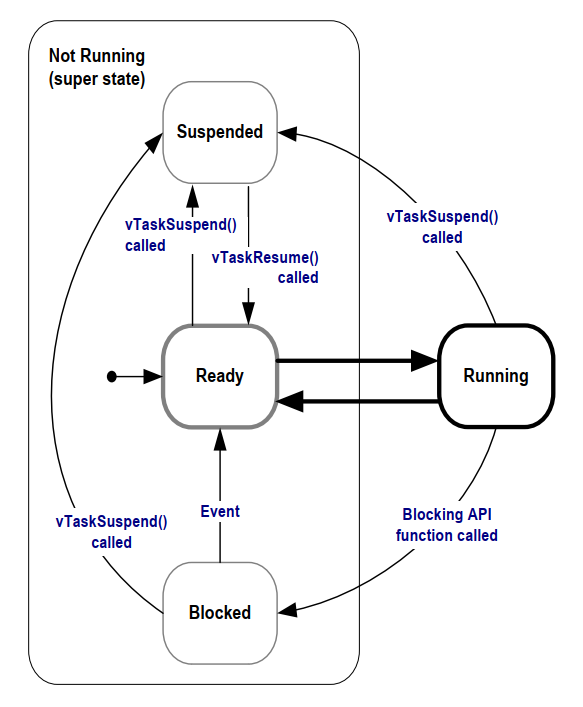

# FreeRTOS – Task Management

## 1. What is a Task?
- In FreeRTOS, a **task** is the smallest unit of execution (similar to a thread in traditional operating systems).
- Each task has:
  - Its own **stack** (local variables, return addresses, etc.).
  - Its own **context** (CPU registers, program counter, etc.).
- The FreeRTOS scheduler switches between tasks to give the illusion of parallel execution.

---

## 2. Creating a Task
Tasks are created using `xTaskCreate()` (or `xTaskCreateStatic()` for static allocation):

```c
BaseType_t xTaskCreate(
    TaskFunction_t pvTaskCode,            // Function implementing the task
    const char * const pcName,            // Task name (debugging)
    configSTACK_DEPTH_TYPE usStackDepth,  // Stack size in words
    void *pvParameters,                   // Parameter to task function
    UBaseType_t uxPriority,               // Task priority
    TaskHandle_t *pxCreatedTask           // Handle (optional)
);
```

### Example
```c
#include <stdio.h>
#include "FreeRTOS.h"
#include "task.h"

void vTaskFunction(void *pvParameters) {
    (void) pvParameters;
    for (;;) {
        printf("Hello from task!\n");
        vTaskDelay(pdMS_TO_TICKS(1000)); // Delay 1 second
    }
}

int main(void) {
    xTaskCreate(vTaskFunction, "DemoTask", 1000, NULL, 1, NULL);
    vTaskStartScheduler();  // Start FreeRTOS
    for (;;) {}             // Should never reach here
}
```

1. Task creation using `xTaskCreate`

```
BaseType_t xTaskCreate( TaskFunction_t pvTaskCode,
                        const char * const pcName,
                        configSTACK_DEPTH_TYPE usStackDepth,
                        void * pvParameters,
                        UBaseType_t uxPriority,
                        TaskHandle_t * pxCreatedTask );
```
- Task state machine



---

## 3. Task States
A task can be in one of the following states:

- **Running**: Currently using the CPU.
- **Ready**: Ready to run, waiting for CPU.
- **Blocked**: Waiting for an event (e.g., delay, semaphore, queue).
- **Suspended**: Explicitly stopped; will not run until resumed.
- **Deleted**: Task has been removed (stack/TCB freed if dynamically allocated).

### State Transition (simplified)
```
      +---------+        event ready        +-------+
      | Blocked |  -----------------------> | Ready |
      +----+----+                           +---+---+
           ^                                    |
           | vTaskDelay / pend on object        | scheduler picks
           |                                    v
       time expires / event occurs           +---+---+
                                             |Running|
                                             +---+---+
                                                 |
                              vTaskSuspend()     | time slice / higher-priority ready
                                                 v
                                             +---+---+
                                             |Suspnd.|
                                             +-------+

Deletion can occur from Running or by another task: vTaskDelete()
```

---

## 4. Task Priority
- Each task has a **priority** (`0` is lowest, `configMAX_PRIORITIES-1` is highest).
- The scheduler always runs the **highest-priority Ready task**.
- Tasks at the same priority **time-slice** (round-robin) if `configUSE_TIME_SLICING` is enabled (it is by default).

---

## 5. Deleting a Task
A task can delete itself or another task:

```c
vTaskDelete(TaskHandle_t xTaskToDelete);  // pass NULL to delete self
```

---

## 6. Suspending and Resuming Tasks
```c
vTaskSuspend(TaskHandle_t xTaskToSuspend);   // NULL to suspend self
vTaskResume(TaskHandle_t xTaskToResume);
```

> Suspended tasks are invisible to the scheduler until resumed.

---

## 7. Task Delay and Yield
- `vTaskDelay(ticks)` → Puts the task into **Blocked** for a given number of ticks.
- `vTaskDelayUntil(&xLastWakeTime, ticks)` → Periodic task with precise cadence.
- `taskYIELD()` → Voluntarily give up CPU to another Ready task of equal priority.

---

## 8. Stack Sizing & Monitoring
- Choose adequate `usStackDepth` per task; too small causes overflows.
- Enable stack checks in `FreeRTOSConfig.h`:
  ```c
  #define configCHECK_FOR_STACK_OVERFLOW 2
  ```
- At runtime, measure usage:
  ```c
  UBaseType_t uxHighWater = uxTaskGetStackHighWaterMark(NULL); // words remaining
  ```

---

## 9. Best Practices
- Keep the **number of tasks minimal**; prefer event-driven designs.
- Assign **priorities by criticality**, not by “importance.”
- Use **blocking APIs** (queues, semaphores, notifications) instead of busy waits.
- Prefer `vTaskDelayUntil()` for **periodic** tasks.
- Avoid heavy work in **ISR**; defer to tasks via **task notifications** or **queues**.
- Monitor **CPU usage** and **stack watermarks** during development.

---

## 10. Useful APIs for Task Management
- Creation & control:
  - `xTaskCreate()`, `xTaskCreateStatic()`
  - `vTaskDelete()`, `vTaskSuspend()`, `vTaskResume()`
- Priority:
  - `uxTaskPriorityGet()`, `vTaskPrioritySet()`
- Introspection & debug:
  - `uxTaskGetStackHighWaterMark()`
  - `vTaskGetInfo()`
  - `vTaskList()` and `vTaskGetRunTimeStats()` (enable with `configUSE_TRACE_FACILITY` and related configs)

---

## 11. Minimal `FreeRTOSConfig.h` Flags (task-related)
```c
#define configUSE_PREEMPTION           1
#define configUSE_TIME_SLICING         1
#define configMAX_PRIORITIES           5
#define configMINIMAL_STACK_SIZE       ((unsigned short)70)
#define configCHECK_FOR_STACK_OVERFLOW 2
#define configUSE_IDLE_HOOK            0
#define configUSE_TICK_HOOK            0
```

---

### Summary
Task management in FreeRTOS centers on **creating**, **scheduling**, **suspending**, and **deleting** tasks with careful **priority** assignment and **blocking** synchronization. Monitor stack usage and avoid busy loops to keep the system responsive and efficient.
